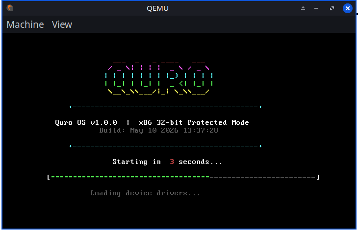
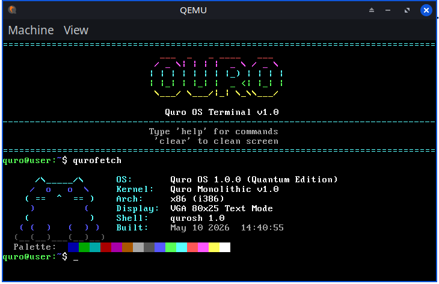
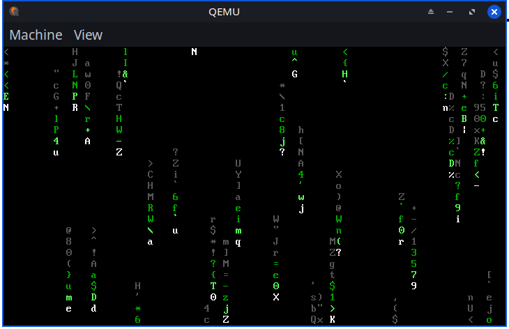

# Quro OS

A simple 32-bit operating system built from scratch in C and Assembly.

## Screenshots

## Features

- VGA Text Mode 80x25 with colored terminal
- PS/2 Keyboard with Shift and Caps Lock
- 5-second animated boot splash
- Matrix Rain screensaver (qmatrix)
- ASCII art system info (qurofetch)
- Real-time Clock (time and date)
- Calculator
- Virtual filesystem
- Command history

## Quick Start

git clone https://github.com/devrudrava/QuroOS.git
cd QuroOS
make run

## Requirements

gcc-multilib, nasm, qemu-system-i386, make

## License

MIT
